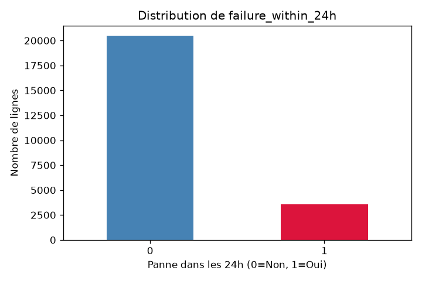
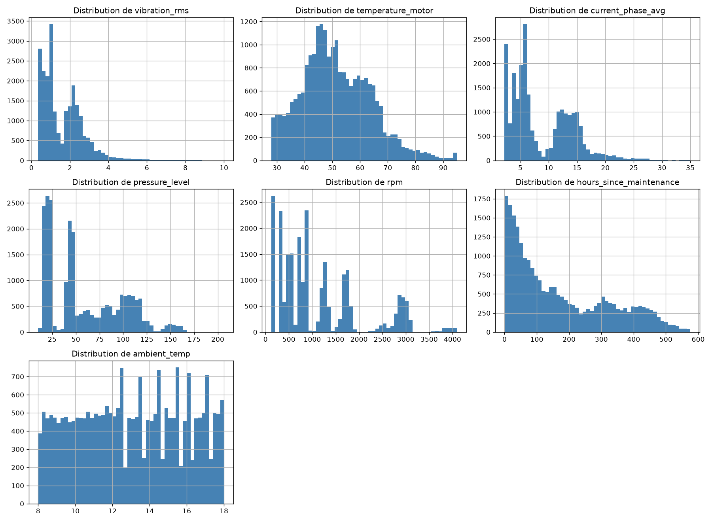
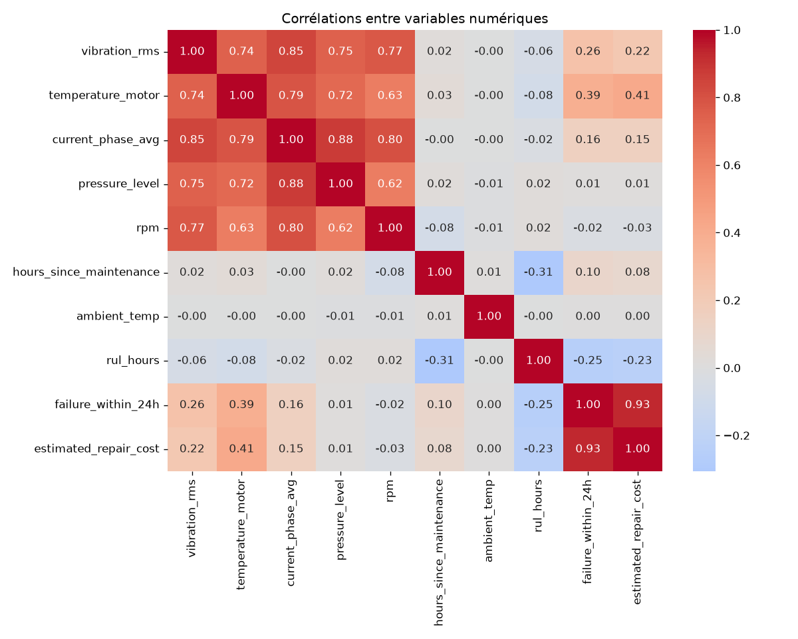
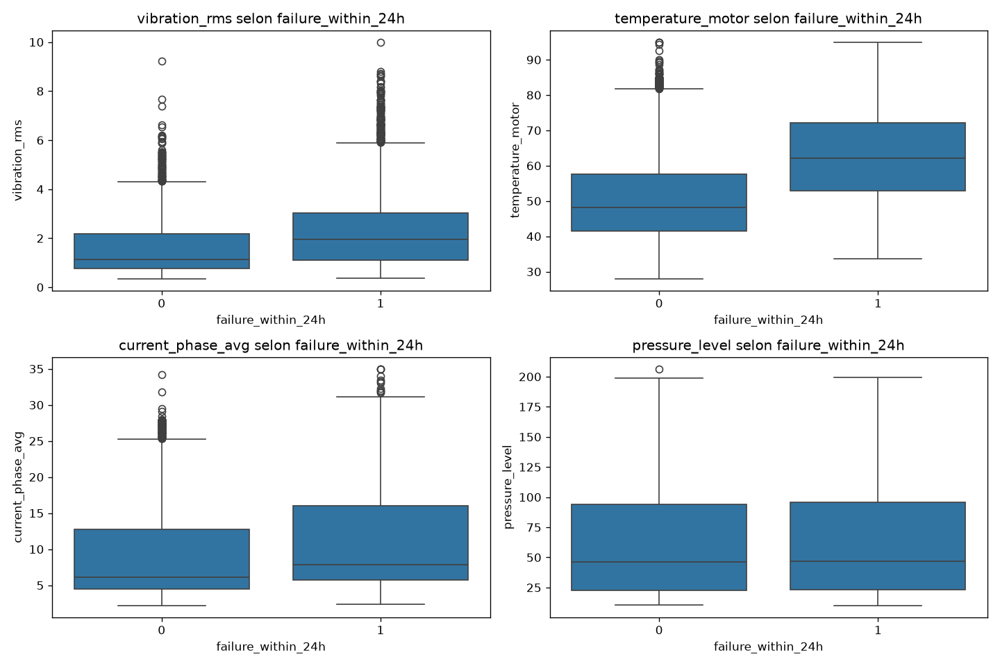
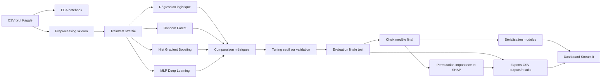
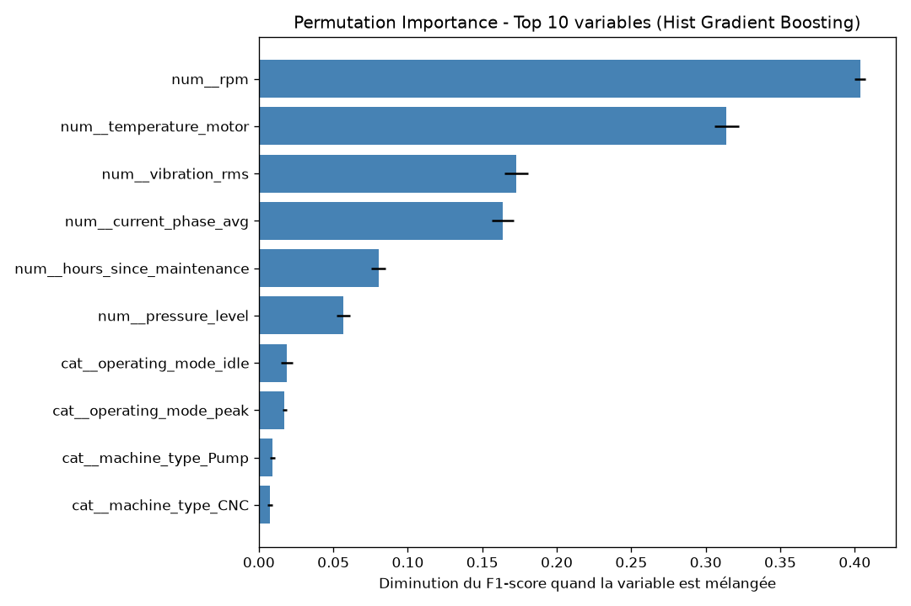
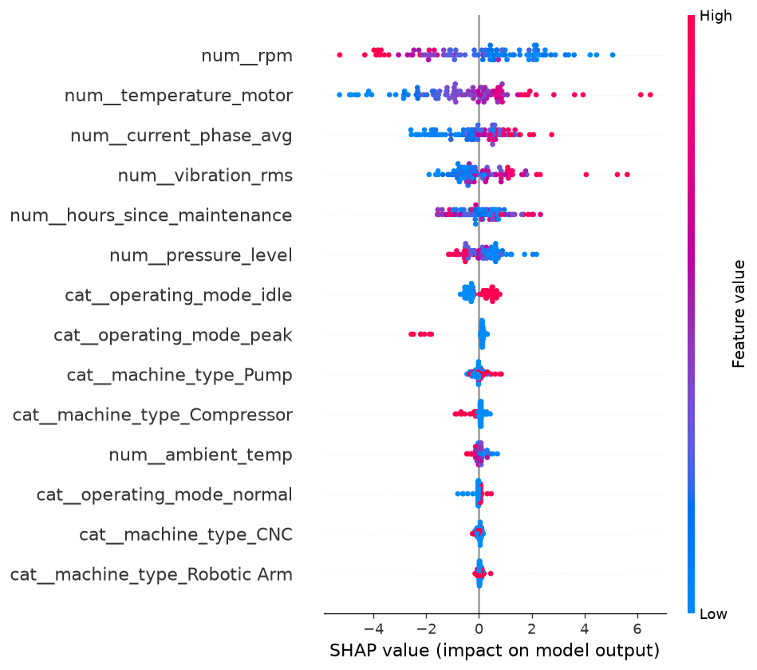

# Rapport Projet Data Science

## Page de garde

**Titre du projet :** Système intelligent multi-modèles pour la maintenance prédictive industrielle

**Promotion :** Mastère Data Engineering et IA - M1

**Année scolaire :** 2025-2026

**Auteurs :** Zuzanna GLINIAK - Tristan BOURHIS

**Formatrice :** Sarah MALAEB

**Date du rapport :** 27/06/2026

**Mention obligatoire :** Projet certifiant RNCP40875 Expert en Ingénierie de Données - Bloc 2 : Pilotage et implémentation de solutions IA.

---

## 1. Résumé exécutif

Ce projet vise à construire une solution de maintenance prédictive industrielle capable d'anticiper les pannes machines dans les 24 heures à partir de données capteurs. Le besoin métier est de permettre à un responsable maintenance de prioriser les interventions, réduire les arrêts non planifiés et mieux piloter les risques opérationnels.

Le dataset utilisé provient de Kaggle : [Industrial Machine Predictive Maintenance](https://www.kaggle.com/datasets/tatheerabbas/industrial-machine-predictive-maintenance?resource=download). Il contient 24 042 observations et 15 colonnes décrivant des machines industrielles, leurs mesures physiques et plusieurs variables de résultat. La tâche prédictive retenue est une classification binaire : prédire la variable `failure_within_24h`.

La démarche suivie couvre l'ensemble d'un pipeline Data Science : analyse exploratoire, préparation des données, gestion des valeurs manquantes, encodage, standardisation, entraînement de plusieurs modèles, comparaison quantitative, interprétabilité et intégration dans un dashboard Streamlit. Quatre modèles principaux sont comparés : régression logistique, Random Forest, Hist Gradient Boosting et MLP Deep Learning.

Le modèle final retenu est le **Hist Gradient Boosting**, car il offre le meilleur compromis opérationnel entre performance, rapidité de prédiction, taille du modèle et facilité de déploiement. Les hyperparamètres des modèles sklearn ont été optimisés par RandomizedSearchCV (scoring F1, StratifiedKFold à 3 folds, 20 itérations) et ceux du MLP par recherche aléatoire manuelle (10 combinaisons sur un split de validation interne). Sur l'évaluation finale, après sélection du seuil sur validation interne, Hist Gradient Boosting obtient un F1-score de 0,914, un recall de 0,934 et un ROC-AUC de 0,996 - le meilleur résultat de tous les modèles testés.

L'outil final proposé est un dashboard décisionnel Streamlit permettant de simuler un scénario machine, obtenir une probabilité de panne, comparer les modèles, consulter les matrices de confusion, visualiser les variables influentes et explorer les données. Une API REST n'a pas été implémentée, car elle est optionnelle dans le cahier des charges, mais elle constitue une piste d'industrialisation naturelle.

---

## 2. Introduction et contexte

La maintenance prédictive consiste à anticiper les défaillances d'équipements avant qu'elles ne provoquent un arrêt de production. Dans un contexte industriel, une panne non planifiée peut entraîner des coûts importants : interruption de chaîne, mobilisation urgente des équipes, perte de rendement, retard de livraison et usure accélérée des équipements.

Les machines modernes produisent des données continues issues de capteurs : vibration, température moteur, courant électrique, pression, vitesse de rotation ou mode de fonctionnement. Ces signaux contiennent souvent des indices avant-coureurs d'une panne. L'objectif du projet est d'exploiter ces signaux avec du Machine Learning supervisé afin de prédire si une machine présente un risque de panne dans les prochaines 24 heures.

Le Machine Learning supervisé est adapté à ce problème car les observations sont associées à une cible connue : `failure_within_24h`. Le modèle apprend une relation entre les variables explicatives et la cible, puis généralise cette relation à de nouveaux scénarios. Le projet ne se limite pas à entraîner un modèle : il construit une chaîne complète allant des données brutes à un outil d'aide à la décision.

---

## 3. Analyse du besoin utilisateur

L'utilisateur cible est un responsable maintenance ou un ingénieur industriel. Son objectif n'est pas de manipuler un notebook, mais de disposer d'un outil simple pour identifier les machines à surveiller et décider quand déclencher une intervention.

Les décisions à soutenir sont les suivantes :

- déterminer si une machine présente un risque de panne dans les 24 heures ;
- prioriser les interventions en fonction du niveau de risque ;
- comprendre quels capteurs contribuent au risque ;
- comparer les modèles pour choisir une solution fiable ;
- suivre les indicateurs clés du dataset et du modèle.

Le dashboard répond à trois scénarios d'usage principaux :

1. **Simulation d'un scénario machine** : l'utilisateur saisit des valeurs de capteurs et obtient une probabilité de panne.
2. **Analyse comparative** : l'utilisateur compare les performances des modèles et comprend pourquoi le modèle final a été retenu.
3. **Exploration et interprétation** : l'utilisateur consulte les distributions, les corrélations et les variables influentes.

Les indicateurs attendus sont la probabilité de panne, le statut de risque, les faux négatifs, les faux positifs, les métriques F1/recall/precision/ROC-AUC, ainsi que l'importance des variables.

---

## 4. Méthodologie de travail et gestion de projet

Le projet a été mené selon une démarche incrémentale proche d'un Kanban technique. Chaque étape a produit un livrable exploitable avant de passer à l'étape suivante :

1. compréhension du sujet et choix de la cible ;
2. analyse exploratoire du dataset ;
3. préparation des données ;
4. entraînement d'une baseline ;
5. gestion du déséquilibre des classes ;
6. comparaison de modèles Machine Learning ;
7. ajout d'un modèle Deep Learning ;
8. ajustement du seuil de décision ;
9. comparaison finale et choix du modèle ;
10. interprétabilité ;
11. développement du dashboard ;
12. documentation et rapport.

L'historique Git montre une progression cohérente : EDA, preprocessing, baseline, modèles ML, MLP, seuils, comparaison finale, interprétabilité, dashboard et README.

### Risques identifiés

| Risque | Impact | Réponse apportée |
|---|---:|---|
| Données manquantes sur les capteurs | Dégradation du modèle | Imputation médiane dans un pipeline |
| Déséquilibre des classes | Accuracy trompeuse | Stratified split, class weights, F1/recall/PR-AUC |
| Data leakage | Scores artificiellement élevés | Exclusion de `rul_hours`, `failure_type`, `estimated_repair_cost` |
| Seuil de décision non optimal | Trop de faux négatifs ou faux positifs | Tuning du seuil sur validation interne |
| Dashboard dépendant d'artefacts absents | Démo impossible | Script `scripts/run_pipeline.py` et exports `outputs/results/` |
| Incompatibilités de dépendances | Reproductibilité fragile | Versions figées dans `requirements.txt` |

---

## 5. Référentiel de données

### Source

Le dataset provient de Kaggle : [Industrial Machine Predictive Maintenance](https://www.kaggle.com/datasets/tatheerabbas/industrial-machine-predictive-maintenance?resource=download).

Le fichier brut utilisé est `predictive_maintenance_v3.csv`. Dans le projet, il est disponible dans `data/raw/` et peut aussi être récupéré depuis le dossier local `../archive/`.

### Volume et structure

- Nombre de lignes : 24 042
- Nombre de colonnes : 15
- Format : CSV
- Tâche retenue : classification binaire
- Variable cible : `failure_within_24h`
- Taux de panne : 14,8%

### Variables principales

| Variable | Type | Rôle métier |
|---|---|---|
| `machine_type` | Catégorielle | Type de machine industrielle |
| `vibration_rms` | Numérique | Niveau de vibration |
| `temperature_motor` | Numérique | Température moteur |
| `current_phase_avg` | Numérique | Courant électrique moyen |
| `pressure_level` | Numérique | Niveau de pression |
| `rpm` | Numérique | Vitesse de rotation |
| `operating_mode` | Catégorielle | Mode de fonctionnement |
| `hours_since_maintenance` | Numérique | Durée depuis dernière maintenance |
| `ambient_temp` | Numérique | Température ambiante |
| `failure_within_24h` | Binaire | Cible prédite |

Certaines variables disponibles ont été exclues de la modélisation afin d'éviter une fuite de données : `rul_hours`, `failure_type` et `estimated_repair_cost`. Ces variables décrivent directement ou indirectement la panne et ne seraient pas forcément disponibles avant l'événement.

---

## 6. Analyse exploratoire des données

L'EDA est réalisée dans `notebooks/01_eda.ipynb`. Elle analyse les types, valeurs manquantes, doublons, distributions, corrélations et relations entre les capteurs et la cible.

### Qualité des données

Les valeurs manquantes apparaissent uniquement sur certains capteurs :

| Variable | Valeurs manquantes |
|---|---:|
| `vibration_rms` | 1000 |
| `temperature_motor` | 834 |
| `current_phase_avg` | 731 |
| `pressure_level` | 924 |
| `rpm` | 533 |

Aucun doublon n'a été identifié. Le dataset contient 20 machines et 4 types de machines.

### Distribution de la cible



Le dataset est déséquilibré : environ 85,2% des observations ne correspondent pas à une panne, contre 14,8% de pannes dans les 24 heures. Une simple accuracy serait donc trompeuse, car un modèle prédisant toujours "pas de panne" obtiendrait déjà une accuracy élevée tout en ratant toutes les pannes.

### Distributions des capteurs



Les variables comme `vibration_rms`, `current_phase_avg`, `pressure_level` et `rpm` présentent des distributions multimodales. Cela peut s'expliquer par la présence de plusieurs types de machines et modes de fonctionnement. La température moteur suit une distribution plus régulière autour de 50 degrés.

### Corrélations



Les variables les plus corrélées avec la cible sont notamment la température moteur, la vibration et les heures depuis maintenance. Les corrélations entre plusieurs capteurs montrent aussi une redondance partielle, ce qui justifie l'usage de modèles capables de gérer des interactions non linéaires.

### Boxplots capteurs / cible



Les pannes sont associées à des profils capteurs plus critiques : température plus élevée, vibration plus forte et comportements mécaniques plus extrêmes. Ces observations confirment la pertinence métier de la tâche.

---

## 7. Préparation et transformation des données

La préparation est implémentée dans `src/preprocessing/pipeline.py`.

### Choix de features

Les variables conservées sont :

- `machine_type`
- `vibration_rms`
- `temperature_motor`
- `current_phase_avg`
- `pressure_level`
- `rpm`
- `operating_mode`
- `hours_since_maintenance`
- `ambient_temp`

Les variables exclues sont :

- `timestamp` et `machine_id`, considérées comme identifiants bruts ;
- `rul_hours`, `failure_type`, `estimated_repair_cost`, considérées comme des risques de leakage.

### Pipeline de transformation

Le pipeline utilise :

- `SimpleImputer(strategy="median")` pour les variables numériques ;
- `StandardScaler` pour standardiser les variables numériques ;
- `OneHotEncoder(handle_unknown="ignore")` pour les variables catégorielles ;
- `ColumnTransformer` pour appliquer les transformations par type de variable.

La séparation train/test est stratifiée afin de conserver la proportion de pannes dans les deux ensembles. Le split utilisé est 80% train et 20% test.

Le preprocessing est ajusté uniquement sur le train set (`fit_transform`) puis appliqué au test set (`transform`). Cette stratégie limite le data leakage.

---

## 8. Pipeline IA et architecture



Le projet est organisé pour séparer les responsabilités :

- `src/preprocessing/` : préparation des données ;
- `src/models/` : entraînement, comparaison, seuils, interprétabilité ;
- `src/dashboard/` : interface Streamlit ;
- `outputs/models/` : artefacts modèles ;
- `outputs/results/` : tableaux de métriques ;
- `outputs/figures/` : graphiques ;
- `scripts/run_pipeline.py` : orchestration complète.

---

## 9. Implémentation technique

### Technologies

| Composant | Technologie |
|---|---|
| Manipulation données | pandas, numpy |
| Modélisation ML | scikit-learn |
| Déséquilibre de classes | class weights, imbalanced-learn |
| Deep Learning | TensorFlow / Keras |
| Interprétabilité | permutation importance, SHAP |
| Visualisation | matplotlib, seaborn, Plotly |
| Dashboard | Streamlit |
| Sérialisation | joblib, format Keras `.keras` |

### Modèles testés

1. **Régression logistique** : baseline interprétable et rapide.
2. **Random Forest** : modèle d'arbres robuste aux non-linéarités.
3. **Hist Gradient Boosting** : modèle performant, compact et rapide.
4. **MLP Deep Learning** : réseau neuronal dense à deux couches cachées.

Les hyperparamètres des modèles sklearn (régression logistique, Random Forest, Hist Gradient Boosting) ont été optimisés par **RandomizedSearchCV** : 20 itérations aléatoires dans l'espace de recherche, scoring F1, validation croisée StratifiedKFold à 3 folds. Pour le MLP, incompatible avec RandomizedSearchCV, une **recherche aléatoire manuelle** a été implémentée : 10 combinaisons testées sur un split de validation interne (80/20 du train set), la meilleure retenue pour l'entraînement final sur le train complet.

Le MLP retenu contient deux couches cachées de 32 et 16 neurones avec activation ReLU, dropout à 0,1 et sortie sigmoid. Un early stopping (patience=10) limite le surapprentissage.

---

## 10. Evaluation comparative des modèles

Les métriques retenues sont adaptées à une classification déséquilibrée :

- **Recall** : capacité à détecter les vraies pannes ;
- **F1-score** : compromis entre precision et recall ;
- **ROC-AUC** : capacité globale de séparation ;
- **PR-AUC** : utile avec classe positive minoritaire ;
- **FN/FP** : lecture opérationnelle des erreurs.

Les résultats finaux générés dans `outputs/results/final_test_metrics.csv` sont les suivants :

| Modèle | Seuil | Accuracy | Precision | Recall | F1 | ROC-AUC | PR-AUC | FN | FP |
|---|---:|---:|---:|---:|---:|---:|---:|---:|---:|
| Régression Logistique | 0,60 | 0,9214 | 0,6868 | 0,8624 | 0,7646 | 0,9589 | 0,8379 | 98 | 280 |
| Random Forest | 0,55 | 0,9661 | 0,8551 | 0,9284 | 0,8902 | 0,9937 | 0,9656 | 51 | 112 |
| **Hist Gradient Boosting** | **0,70** | **0,9738** | **0,8938** | **0,9340** | **0,9135** | **0,9960** | **0,9794** | **47** | **79** |
| MLP Deep Learning | 0,75 | 0,9426 | 0,7646 | 0,8848 | 0,8203 | 0,9813 | 0,8976 | 82 | 194 |

**Note sur l'Accuracy :** un modèle prédisant systématiquement "pas de panne" obtiendrait 85,2% d'Accuracy (4 097 / 4 809), sans détecter une seule panne. L'Accuracy est donc une métrique trompeuse sur ce dataset déséquilibré (14,8% de pannes) et ne constitue pas le critère de sélection principal. Le F1-score et le Recall sont les métriques déterminantes ici.

Après optimisation des hyperparamètres par RandomizedSearchCV, **Hist Gradient Boosting est le meilleur modèle sur les critères principaux** : F1 = 0,914 contre 0,890 pour Random Forest, recall = 0,934 contre 0,928, et 47 FN contre 51 pour Random Forest.

Le choix de **Hist Gradient Boosting** comme modèle final est donc renforcé par le tuning : il surpasse Random Forest sur les métriques de performance tout en étant nettement plus léger et plus rapide. Hist Gradient Boosting pèse 344 Ko contre 38 084 Ko pour Random Forest, et prédit en 3,45 ms contre 47,69 ms. Dans un usage de dashboard ou de service de prédiction appelé fréquemment, ce triple avantage - meilleure performance, déploiement plus simple et empreinte computationnelle réduite - en fait le choix optimal.

Le tuning du seuil est désormais réalisé sur une validation interne du train set, puis appliqué au test set. Cette correction évite de choisir le seuil en regardant directement la performance finale du test.

### Analyse des erreurs

Le test set contient 712 pannes réelles et 4 097 machines saines (4 809 observations au total). L'analyse des erreurs distingue deux types de prédictions incorrectes aux conséquences asymétriques.

**Faux négatifs (FN) - pannes non détectées**

Les FN sont les erreurs les plus coûteuses dans un contexte industriel : une panne non anticipée entraîne un arrêt non planifié, une mobilisation d'urgence et potentiellement des dégâts matériels.

| Modèle | FN | Taux manqué |
|---|---:|---:|
| Régression Logistique | 98 | 13,8 % |
| MLP Deep Learning | 82 | 11,5 % |
| Random Forest | 51 | 7,2 % |
| **Hist Gradient Boosting** | **47** | **6,6 %** |

HistGB manque 47 pannes sur 712, soit 6,6 % des défaillances réelles. Ces cas correspondent vraisemblablement à des machines dont les capteurs présentent des valeurs proches des seuils de séparation : un profil globalement normal avec un seul indicateur légèrement dégradé, insuffisant pour déclencher l'alerte. Le dataset étant simulé, ces cas limites peuvent aussi refléter du bruit dans la génération des données plutôt qu'une ambiguïté physique réelle.

**Faux positifs (FP) - fausses alertes**

Les FP génèrent des interventions inutiles et, à terme, une "fatigue d'alerte" chez les opérateurs qui finissent par ignorer les notifications.

| Modèle | FP | Taux fausse alerte |
|---|---:|---:|
| Régression Logistique | 280 | 6,8 % |
| MLP Deep Learning | 194 | 4,7 % |
| Random Forest | 112 | 2,7 % |
| **Hist Gradient Boosting** | **79** | **1,9 %** |

HistGB déclenche 79 fausses alertes sur 4 097 machines saines (1,9 %). Ces erreurs correspondent probablement à des machines fonctionnant temporairement en mode "peak" avec des vibrations ou une température élevée, sans qu'une panne soit imminente : le signal capteur est anormal mais sans conséquence réelle.

**Bilan et recommandation opérationnelle**

HistGB minimise les deux types d'erreurs simultanément. Pour un responsable maintenance, cela se traduit par : 47 pannes manquées à surveiller manuellement en complément, et 79 fausses alertes à filtrer. Ce bilan reste gérable à l'échelle d'un parc industriel. Pour réduire davantage les FN, on pourrait abaisser le seuil de décision en dessous de 0,70, au prix d'un nombre de FP légèrement plus élevé.

---

## 11. Interprétabilité et analyse métier

L'interprétabilité est réalisée avec deux approches :

- **Permutation Importance** : mesure la perte de F1-score quand une variable est mélangée ;
- **SHAP** : explique l'impact local et global des variables sur les prédictions.



Les variables les plus influentes sont :

1. vitesse de rotation (`rpm`) - 40% ;
2. température moteur - 31% ;
3. vibration (RMS) - 17% ;
4. courant électrique - 16% ;
5. pression - 6%.

Cette hiérarchie est cohérente avec le domaine industriel : une machine soumise à des régimes élevés, une température anormale, une consommation électrique élevée et des vibrations importantes présente un risque plus élevé.



SHAP apporte une lecture plus fine : il permet de comprendre si une valeur élevée ou basse pousse la prédiction vers le risque de panne. Cette information est utile pour transformer une probabilité brute en explication exploitable par un responsable maintenance.

---

## 12. Interface utilisateur et prototype

Le dashboard est développé avec Streamlit dans `src/dashboard/app.py`. Il est organisé en quatre onglets.

### Onglet 1 : prédiction en temps réel

L'utilisateur saisit un scénario machine :

- type de machine ;
- mode opératoire ;
- vibration ;
- température moteur ;
- courant électrique ;
- pression ;
- vitesse de rotation ;
- heures depuis maintenance ;
- température ambiante.

Le dashboard transforme ces données avec le même préprocesseur que celui utilisé à l'entraînement, puis applique le modèle final. Le résultat est affiché sous forme de probabilité et de jauge de risque.

### Onglet 2 : comparaison des modèles

Cet onglet présente les métriques, les matrices de confusion et un bilan écoresponsabilité. Il explique pourquoi le modèle final est retenu.

### Onglet 3 : importance des variables

L'utilisateur visualise les variables qui influencent le plus les prédictions, ainsi qu'une figure SHAP si elle a été générée.

### Onglet 4 : exploration des données

Cet onglet permet de consulter les KPI du dataset, les distributions par classe, les boxplots et la matrice de corrélation.

Le dashboard charge en priorité les résultats exportés dans `outputs/results/`. S'ils sont absents, il conserve des valeurs de démonstration pour garder l'interface lisible, mais le pipeline complet est recommandé avant soutenance.

---

## 13. API REST

Aucune API REST n'a été implémentée dans cette version. Cette partie était optionnelle dans le sujet. L'architecture du projet prépare toutefois une extension simple : le préprocesseur et le modèle final sont sérialisés, ce qui permettrait de créer une API FastAPI avec :

- `GET /health` pour vérifier que le service est actif ;
- `POST /predict` pour recevoir un scénario machine en JSON ;
- `GET /model-info` pour exposer le modèle utilisé, le seuil et les features attendues.

Une industrialisation plus réaliste pourrait faire communiquer le dashboard avec l'API au lieu de charger directement le modèle.

---

## 14. Résultats et tests de démonstration

Deux types de scénarios peuvent être préparés pour la démonstration :

### Scénario faible risque

- vibration proche de la médiane ;
- température moteur autour de 50 degrés ;
- courant modéré ;
- mode `normal` ou `idle` ;
- heures depuis maintenance raisonnables.

Le modèle devrait retourner une probabilité faible et classer la machine comme sans risque immédiat.

### Scénario risque élevé

- vibration élevée ;
- température moteur élevée ;
- courant électrique élevé ;
- régime moteur important ;
- mode `peak` ;
- maintenance ancienne.

Le modèle devrait retourner une probabilité forte et recommander une intervention ou une surveillance renforcée.

Les tests de démonstration doivent être réalisés dans Streamlit après génération des artefacts :

```bash
python scripts/run_pipeline.py
streamlit run src/dashboard/app.py
```

---

## 15. Gouvernance, responsabilité et limites

La solution doit être considérée comme un outil d'aide à la décision, pas comme un système autonome remplaçant l'expertise humaine.

### Qualité et traçabilité

Le pipeline est traçable : dataset brut, preprocessing, modèles, seuils et métriques sont séparés. Les fichiers de résultats sont exportés dans `outputs/results/`, ce qui facilite l'audit.

### Risques

- **Dérive des données** : les machines réelles peuvent évoluer dans le temps.
- **Biais dataset** : le dataset est simulé et peut ne pas couvrir tous les cas industriels.
- **Faux négatifs** : une panne non détectée peut coûter cher.
- **Faux positifs** : trop d'alertes peuvent créer de la fatigue opérationnelle.
- **Interprétabilité partielle** : SHAP aide à expliquer, mais ne prouve pas une causalité.

### Mesures recommandées en production

- suivi mensuel des métriques ;
- surveillance du taux de faux négatifs ;
- recalibrage périodique du seuil ;
- réentraînement avec nouvelles données ;
- validation humaine des alertes critiques ;
- journalisation des prédictions.

---

## 16. Limites et pistes d'amélioration

### Limites

- Dataset simulé et volume limité à environ 24 000 lignes.
- Pas de vraie série temporelle exploitée malgré la présence d'un timestamp.
- Une seule tâche prédictive traitée, alors que le dataset permettrait aussi la régression du RUL ou la classification du type de panne.
- API REST non implémentée.
- Dashboard local, sans déploiement cloud.
- Hyperparamètres optimisés par RandomizedSearchCV (sklearn) et recherche aléatoire manuelle (MLP) - exploration partielle de l'espace, non exhaustive.

### Améliorations possibles

1. Ajouter une API FastAPI avec `/predict`, `/health` et `/model-info`.
2. Déployer le dashboard sur Streamlit Community Cloud ou une VM.
3. Ajouter un monitoring de drift et de performance.
4. Tester des modèles temporels si l'ordre chronologique est exploitable.
5. Ajouter une tâche secondaire : estimation du `rul_hours` ou classification `failure_type`.
6. Ajouter des tests automatisés sur le chargement des artefacts et une prédiction type.
7. Explorer BayesSearch ou Optuna pour un tuning plus efficace des hyperparamètres.
8. Produire des captures d'écran définitives du dashboard pour la soutenance.

---

## 17. Conclusion

Ce projet démontre une démarche Data Science complète appliquée à la maintenance prédictive industrielle. A partir d'un dataset brut Kaggle, la solution réalise une analyse exploratoire, prépare les données, entraîne plusieurs modèles, compare leurs performances, interprète les prédictions et propose un dashboard décisionnel.

Le modèle final retenu est le Hist Gradient Boosting, car il représente le meilleur compromis entre performance, stabilité, coût de calcul, taille du modèle et facilité d'intégration. Après optimisation des hyperparamètres par RandomizedSearchCV, il obtient le meilleur F1-score (0,914) et le meilleur recall (0,934) tout en étant environ 111 fois plus léger et 14 fois plus rapide que le Random Forest. Le projet montre également que le Deep Learning n'est pas systématiquement supérieur : le MLP obtient des résultats corrects, mais n'apporte pas de gain suffisant par rapport aux modèles d'arbres.

La valeur métier de la solution réside dans sa capacité à transformer des signaux capteurs en information actionnable : probabilité de panne, niveau de risque, variables explicatives et comparaison des modèles. La solution reste perfectible, notamment sur l'API, le déploiement et le monitoring, mais elle constitue un MVP solide et explicable.

---

## 18. Annexes

### Arborescence principale

```text
projet-maintenance-predictive/
├── data/
│   ├── raw/
│   └── processed/
├── notebooks/
├── outputs/
│   ├── figures/
│   ├── models/
│   └── results/
├── reports/
├── scripts/
├── src/
│   ├── dashboard/
│   ├── models/
│   └── preprocessing/
├── README.md
└── requirements.txt
```

### Commandes principales

```bash
python -m venv .venv
source .venv/bin/activate
pip install -r requirements.txt
python scripts/run_pipeline.py
streamlit run src/dashboard/app.py
```

### Fichiers de résultats générés

- `outputs/results/baseline_results.csv`
- `outputs/results/rebalancing_comparison.csv`
- `outputs/results/ml_models_comparison.csv`
- `outputs/results/mlp_results.csv`
- `outputs/results/threshold_tuning.csv`
- `outputs/results/final_model_comparison.csv`
- `outputs/results/final_test_metrics.csv`
- `outputs/results/feature_importance.csv`

### Dépendances principales

Les dépendances sont figées dans `requirements.txt` pour améliorer la reproductibilité.
